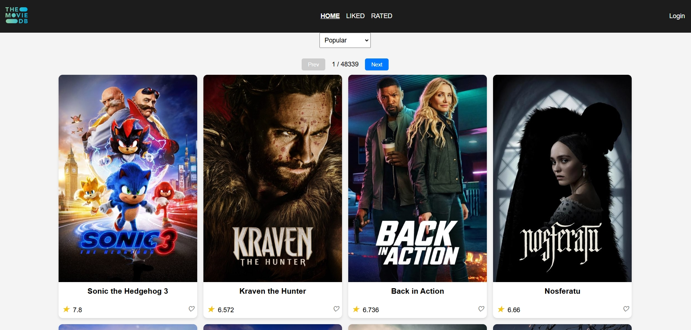
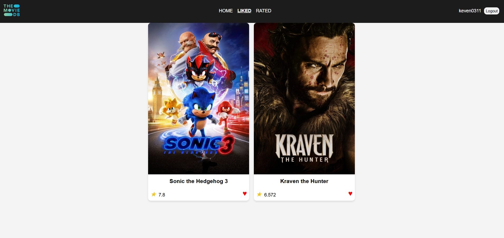
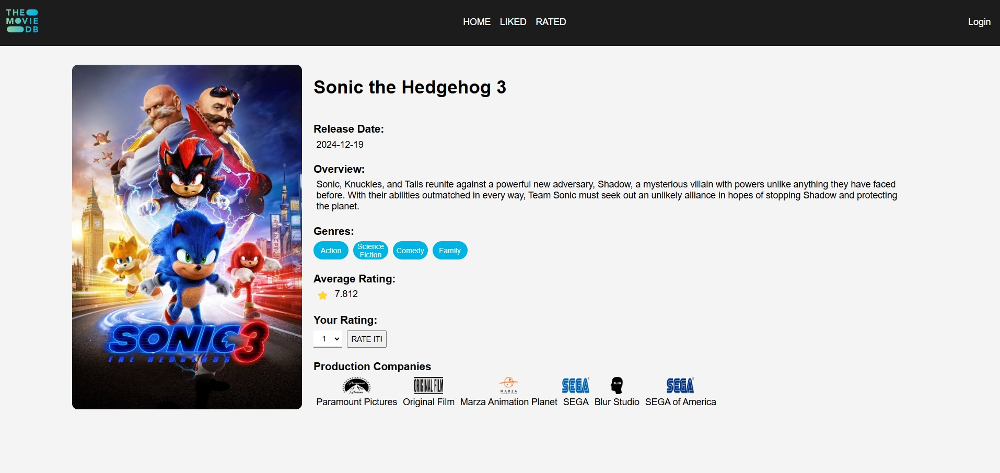
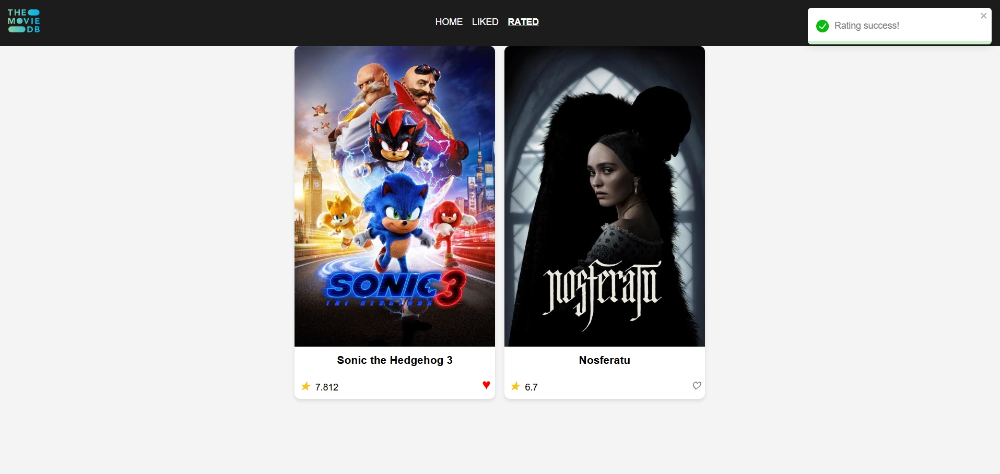

# MoviesDB App

**MoviesDB App** is a dynamic front-end application built with React.js that allows users to explore movies based on categories such as **popularity**, **upcoming releases**, **top-rated movies**, and **currently playing films**. Powered by the [Themoviedb API](https://developer.themoviedb.org/docs/getting-started), this app fetches movie data and displays it seamlessly on the browser.

After logging in, users can interact with their favorite movies, rate them, and save them for future viewing.

## Features

- **Browse Movies**: Display movies categorized by:
  - Popularity
  - Upcoming releases
  - Top-rated
  - Now playing
- **User Interaction**: Once logged in, users can:
  - Rate their favorite movies
  - Like movies to save them for future viewing
- **Responsive Design**: The app is built to be responsive, ensuring smooth user experience on both desktop and mobile devices.

- **Error Handling**: User-friendly error handling with `react-toastify` for real-time notifications.

## Technologies

- **Framework**: React.js
- **Routing**: `react-router-dom` for page navigation
- **Notifications**: `react-toastify` for showing success/error notifications
- **Bundler**: Vite for fast and optimized development

## API Integration

This app integrates with the [Themoviedb API](https://developer.themoviedb.org/docs/getting-started) to fetch and display movie data. You can explore the API for additional functionality or create your own app based on their documentation.

## Screenshots

### Home page



### Liked tab



### Movie Details



### Rated tab



## Installation

To run this app locally, follow these steps:
cd moviedb
npm install
npm run dev

1. **Clone the repository:**

   ```bash
   git clone https://github.com/keven0311/MovieDB_Web.git
   ```

